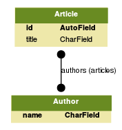
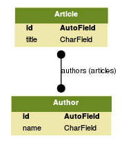

# Django Change PK (a.k.a. the *motherfucker* migration)

This project's goal is to provide the required database migration to change the PK column in a Django model when:

* The current PK is a custom (or *natural*) one 
* The desired PK is an *AutoField* (indeed, this is the *surrogate* key that Django would have generated automatically if no PK had been specified)
* The model is already part of a Many-To-Many relationship

Why would anyone want to mess up the database in the first place? Well, let's face it: shit happens (a lot).

## Prerequisites

To run this project, you need to install the following system dependencies:
* Python 2 (optionally you can install [pyenv](https://github.com/pyenv/pyenv-virtualenv) to manage different versions of python as well as your virtualenvs as shown later on)
* MySQL

The dependence on MySQL is due to the fact that the provided migration relies on MySQL-specific DDL statements that will not work (out of the box) for other databases.

> More precisely, this project has only been tested with:
> * Python 2.7.13
> * MySQL 5.7.15
> 
> It might not work for different versions. Having said that, it should be simple enough to adapt the code to work in your specific case, even if you are using a different SQL database (e.g., Postgres).

## Getting Started

This project reproduces the considered scenario based on a dummy Django app. In order to run it, follow these steps:

First, go to your projects folder and clone this repo:

```
git clone git@github.com:salvalcantara/django-change-pk.git
```

Optionally, if you are using pyenv, create a new virtualenv as indicated below:

```
pyenv install 2.7.13 && pyenv virtualenv 2.7.13 change_pk_key
```

Now, cd into the new project folder:

```
cd django-change-pk
```

If you created the virtualenv before, your prompt should have changed to reflect that you are in the `change-pk` virtualenv (otherwise select the virtualenv manually by typing `pyenv activate change_pk`).

Install the python requirements:

```
pip install -r requirements.txt
```

> Django 1.7.3 is being used here. This is so because the present project was created to support a legacy application. 
> It has not been tested with more recent versions, but the code would probably work just fine.

Finally, it is necessary to run the migrations. Before that, make sure that you have installed MySQL locally according to the following settings (`change_pk/settings.py`):

```python
DATABASES = {                                                                    
    'default': {                                                                 
        'ENGINE': 'django.db.backends.mysql',                                    
        'NAME': 'change_pk',                                                     
        'USER': 'root',                                                          
        'PASSWORD': 'root',                                                      
        'HOST': '127.0.0.1',                                                     
        'PORT': '3306',                                                          
    }                                                                            
}
```

Then, run the following command to create the required database first:

```
mysql -u root -proot -e "CREATE DATABASE change_pk"
```

At this point, you can finally run the migrations:

```
./manage.py migrate
```

The dummy app has the following models in place:

```python
class Author(models.Model):
    name = models.CharField(max_length=30, primary_key=True)


class Article(models.Model):
    title = models.CharField(max_length=140)
    authors = models.ManyToManyField(Author, related_name='articles')
```

as depicted in the following diagram:



Also, the following initial data was loaded from a fixture:

```
mysql> select * from app_author;
+---------------+
| name          |
+---------------+
| A. Visioli    |
| C. Pedret     |
| F. Padula     |
| R. Vilanova   |
| S. Alcántara  |
| S. Skogestad  |
+---------------+
```

```
mysql> mysql> select * from app_article;
+----+-------------------------------------------------------------------------------+
| id | title                                                                         |
+----+-------------------------------------------------------------------------------+
|  1 | PID control in terms of robustness/performance and servo/regulator trade-offs |
|  2 | H-infinity control of fractional linear systems                               |
|  3 | Simple analytic rules for model reduction and PID controller tuning           |
+----+-------------------------------------------------------------------------------+
```

```
mysql> select * from app_article_authors;
+----+------------+---------------+
| id | article_id | author_id     |
+----+------------+---------------+
|  1 |          1 | C. Pedret     |
|  3 |          1 | R. Vilanova   |
|  2 |          1 | S. Alcántara  |
|  5 |          2 | A. Visioli    |
|  4 |          2 | F. Padula     |
|  6 |          2 | S. Alcántara  |
|  7 |          3 | S. Skogestad  |
+----+------------+---------------+
```

### Changing the PK column

In an ideal world, we would just modify our `Author` class like this:

```python
class Author(models.Model):
    name = models.CharField(max_length=30, unique=True)
```

and run:

```
./manage.py makemigrations app
```

However, that alone would not work:

```
You are trying to add a non-nullable field 'id' to author without a default; 
we can't do that (the database needs something to populate existing rows).
Please select a fix:
 1) Provide a one-off default now (will be set on all existing rows)
 2) Quit, and let me add a default in models.py 
```

Long story short, there are several issues to be addressed at the database level, and that is what this project is all about. The required database migration is provided in another branch. Please, check it out:

```
git checkout do_the_magic
``` 

The `do_the_magic` branch has already modified our `Author` class as illustrated above (by replacing `primary_key=True` with `unique=True` in the `name` field). In addition, it provides the required migration which can be run by typing:

```
./manage.py migrate app
```

After running it, things will be left in the desired state:



as can be confirmed from the database:

```
mysql> select * from app_author;
+---------------+----+
| name          | id |
+---------------+----+
| A. Visioli    |  1 |
| C. Pedret     |  2 |
| F. Padula     |  3 |
| R. Vilanova   |  4 |
| S. Alcántara  |  5 |
| S. Skogestad  |  6 |
+---------------+----+
```

```
mysql> select * from app_article_authors;
+----+------------+-----------+
| id | article_id | author_id |
+----+------------+-----------+
|  1 |          1 |         2 |
|  3 |          1 |         4 |
|  2 |          1 |         5 |
|  5 |          2 |         1 |
|  4 |          2 |         3 |
|  6 |          2 |         5 |
|  7 |          3 |         6 |
+----+------------+-----------+
```

## Deployment

The provided database migration has been parametrized in order to make it easy to reuse it. To run it in your production environment, do the following:

1. Modify your model by replacing `primary_key=True` with `unique=True` in the PK column definition  
2. Create a new (empty) migration in your Django app
3. Copy the contents of the file `app/migrations/0003_do_the_magic.py` (in the `do_the_magic` branch) in your new migration
4. Adjust the following settings to your case:
```python
dependencies = [
    ('app', '0002_load_initial_data'),
]

# The model with the pk column to be replaced with the default auto field (id)
model_name = 'author'

# Info for the current pk column
pk_name = 'name'
pk_sql_type = 'VARCHAR(30)'
pk_final_django_field = models.CharField(max_length=30, unique=True)
# This is the column definition as it appears in
# models.py after replacing primary_key=True with
# unique=True in Step 1

# The other model being part of the many-to-many relationship
related_model_name = 'article'
related_model_owns_m2m = True  # Set to False if m2m rel. is defined in model
``` 
5. Run the migration
```
./manage.py migrate your_app_name
```

## Contributing

Please, feel free to improve/extend the present project in any conceivable form, for example, by testing/migrating the code to work with other databases and/or Django versions. Pull requests are welcome, but you can also create your own fork if you prefer.

## License

The MIT License (MIT)

Copyright (c) 2017 Salva Alcántara

Permission is hereby granted, free of charge, to any person obtaining a copy of this software and associated documentation files (the "Software"), to deal in the Software without restriction, including without limitation the rights to use, copy, modify, merge, publish, distribute, sublicense, and/or sell copies of the Software, and to permit persons to whom the Software is furnished to do so, subject to the following conditions:

The above copyright notice and this permission notice shall be included in all copies or substantial portions of the Software.

THE SOFTWARE IS PROVIDED "AS IS", WITHOUT WARRANTY OF ANY KIND, EXPRESS OR IMPLIED, INCLUDING BUT NOT LIMITED TO THE WARRANTIES OF MERCHANTABILITY, FITNESS FOR A PARTICULAR PURPOSE AND NONINFRINGEMENT. IN NO EVENT SHALL THE AUTHORS OR COPYRIGHT HOLDERS BE LIABLE FOR ANY CLAIM, DAMAGES OR OTHER LIABILITY, WHETHER IN AN ACTION OF CONTRACT, TORT OR OTHERWISE, ARISING FROM, OUT OF OR IN CONNECTION WITH THE SOFTWARE OR THE USE OR OTHER DEALINGS IN THE SOFTWARE.
